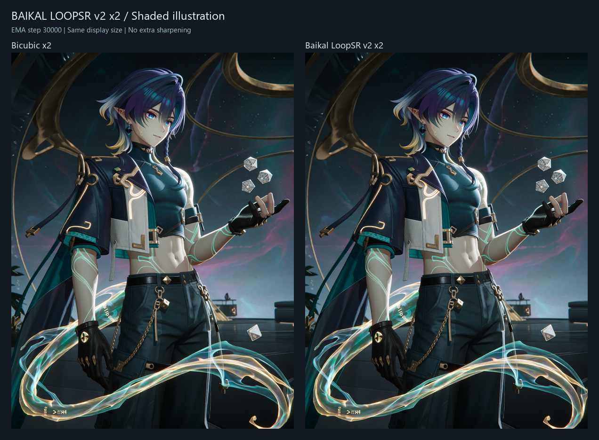
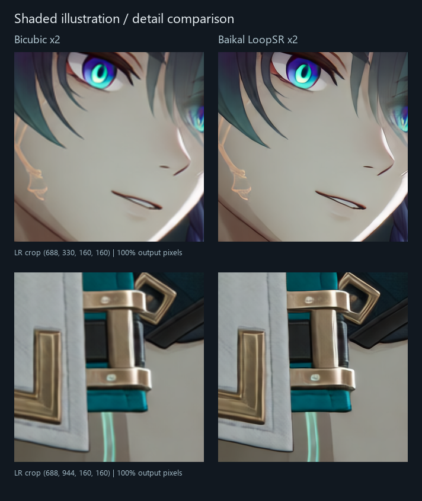
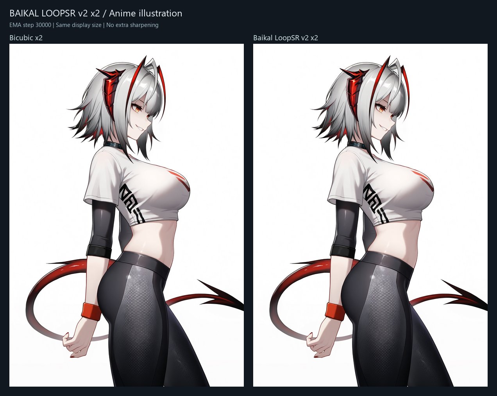
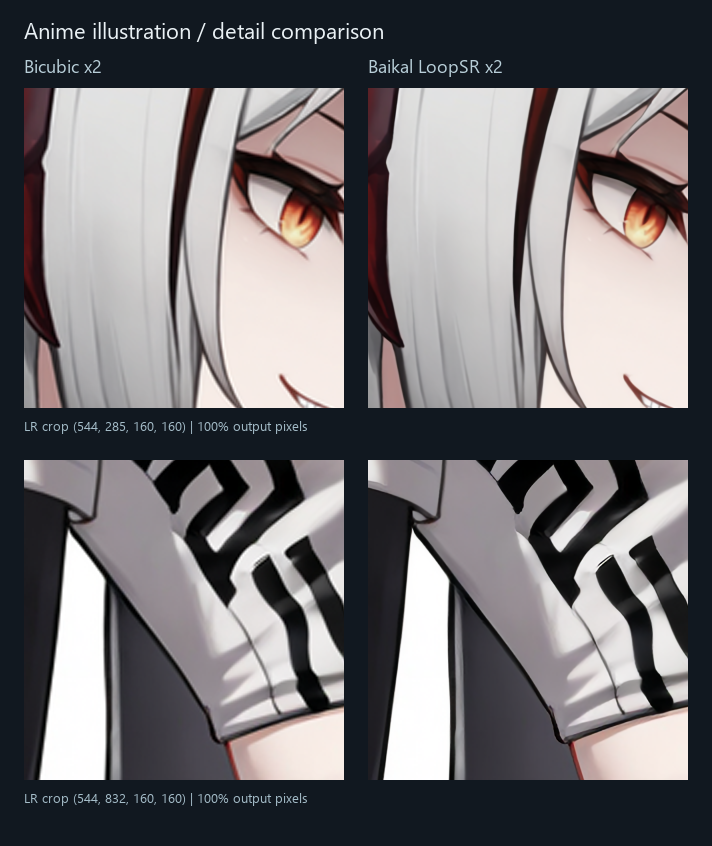

# Baikal Anime Upscaler

**x2 upscaling for anime and illustrations**, with Baikal LoopSR and SwinFIR v31.

[Download models](https://huggingface.co/SnJake/Baikal-Anime-Upscaler/tree/dev) · [Example workflow](workflows/Baikal_LoopSR_x2.json)

## Examples

**Bicubic x2 → Baikal LoopSR x2.** Same display size, no additional sharpening. LoopSR: EMA step 24000, loops 4.









Full-resolution inputs/results: [Hugging Face examples](https://huggingface.co/SnJake/Baikal-Anime-Upscaler/tree/dev/examples).

## Installation

Clone into `ComfyUI/custom_nodes`, install requirements with ComfyUI's Python, then restart:

```bash
git clone --branch dev https://github.com/SnJake/ComfyUI-Baikal-Anime.git
python -m pip install -r ComfyUI-Baikal-Anime/requirements.txt
```

For Windows portable, from its root:

```powershell
python_embeded\python.exe -m pip install -r ComfyUI\custom_nodes\ComfyUI-Baikal-Anime\requirements.txt
```

Use one checkout; update the existing installation instead of installing a duplicate. Place weights in **`ComfyUI/models/anime_upscale/`** or let the loader download them.

## Usage

Category **`Baikal/Upscale`**: **Baikal Model Loader → Baikal Anime Upscale → Save Image**.

| Model | File |
|---|---|
| Baikal LoopSR x2 | `Baikal_LoopSR_x2.safetensors` |
| Baikal SwinFIR v31 | `Baikal_SwinFIR_Anime_x2_v31.safetensors` |

LoopSR supports **loops 1–4**. Default tiling: **256 / overlap 32 / halo 96** in LR pixels; `tile: 0` attempts a whole-image forward. Precision: auto/BF16/FP16/none, CPU or CUDA. The loader's `UPSCALE_MODEL` output also works with the standard image-upscaling node.

Standalone LoopSR:

```bash
python tools/infer.py --weights Baikal_LoopSR_x2.safetensors --input input.png --output output.png
```

LoopSR adapts shared loops, XSA and deep supervision from [Looped Diffusion Transformer](https://arxiv.org/abs/2609.40305). [Technical notes](docs/TRAINING.md).

MIT · [License](LICENSE.md)
